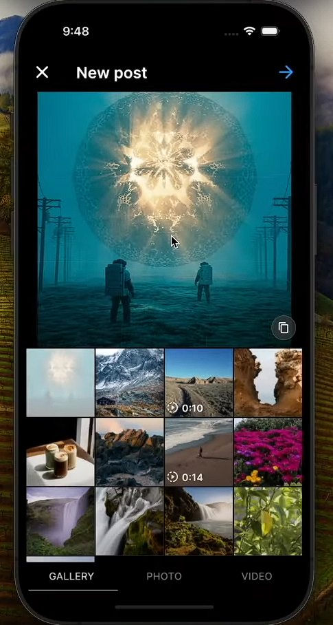

# Let's Connect 🌟


<!-- [](https://github.com/HarshSahu23/lets-connect/actions) -->
[](https://codecov.io/gh/HarshSahu23/lets-connect)
[](https://pub.dev/packages/very_good_analysis)
[](https://opensource.org/licenses/MIT)

> **Connect, Share, Engage** - A modern social media platform built with Flutter

Let's Connect is a feature-rich social media application that enables users to share moments, connect with friends, and engage with content seamlessly - both online and offline. Built with Flutter and powered by a robust backend stack, it offers a smooth, native experience across multiple platforms.

## ✨ Key Features

### 📱 Content Sharing & Discovery
- **Image & Video Sharing**: Share your precious moments in high quality
- **Reels**: Create, share, and discover short-form vertical videos
- **Smart Feed**: Personalized content feed based on your interests and interactions
- **Explore Section**: Discover trending content, new creators, and interesting topics
- **Story Support**: Share ephemeral content that lasts 24 hours

### 💬 Social Interactions
- **Advanced Comments System**:
  - Nested comments with replies
  - React to comments with emojis
  - Rich text formatting support
  - @mentions and #hashtags
- **Direct Messaging**:
  - Real-time chat with friends
  - Media sharing in conversations
  - Read receipts and typing indicators
  - Message reactions

### 🔔 Smart Notifications
- Real-time notifications via Firebase Cloud Messaging (FCM)
- Customizable notification preferences
- Activity notifications for:
  - Likes and comments on your posts
  - New followers and friend requests
  - Mentions and tags
  - Direct messages

### 🌐 Offline-First Architecture
- **Seamless Offline Experience**:
  - View and interact with previously loaded content
  - Create posts and comments while offline
  - Queue actions for sync when back online
- **Smart Sync**: 
  - Efficient data synchronization using PowerSync
  - Background sync with minimal data usage
  - Conflict resolution for concurrent changes

### 👤 Profile & Customization
- Customizable user profiles
- Activity history and statistics
- Content collections and saved posts
- Privacy settings and account management

## 🛠️ Technical Stack

### Frontend
- **Framework**: Flutter & Dart
- **State Management**: Bloc pattern
- **Local Storage**: PowerSync
- **UI/UX**: Material Design 3.0
- **Analytics**: Firebase Analytics

### Backend
- **Database**: PostgreSQL
- **Backend Service**: Supabase
- **Authentication**: Firebase Auth
- **Push Notifications**: Firebase Cloud Messaging
- **File Storage**: Supabase Storage

## 📱 Screenshots

| Feed | Explore | Comments | Share |
|------|---------|-----------|-------|
|||||

| Notifications | Reply to Chat | Create Post | Profile |
|--------------|------|-------------|---------|
|||||

## 🚀 Getting Started

### Prerequisites
- Flutter SDK (>=3.0.0)
- Dart SDK (>=3.0.0)
- Android Studio / VS Code
- Firebase project setup
- Supabase project setup

### Installation

1. Clone the repository:
```bash
git clone https://github.com/HarshSahu23/lets-connect.git
cd lets-connect
```

2. Install dependencies:
```bash
flutter pub get
```

3. Set up environment variables:
```bash
cp .env.example .env
```
Edit `.env` with your configuration values.

### Running the App

This project contains 3 flavors:

- development
- staging
- production

To run the desired flavor either use the launch configuration in VSCode/Android Studio or use the following commands:

```sh
# Development
$ flutter run --flavor development --target lib/main_development.dart

# Staging
$ flutter run --flavor staging --target lib/main_staging.dart

# Production
$ flutter run --flavor production --target lib/main_production.dart
```

_\*Let's Connect works on iOS, Android, Web, and Windows._

## 🧪 Running Tests

To run all unit and widget tests use the following command:

```sh
$ flutter test --coverage --test-randomize-ordering-seed random
```

To view the generated coverage report you can use [lcov](https://github.com/linux-test-project/lcov).

```sh
# Generate Coverage Report
$ genhtml coverage/lcov.info -o coverage/

# Open Coverage Report
$ open coverage/index.html
```

## 🌐 Localization

This project supports multiple languages using Flutter's built-in internationalization system. See [Working with Translations](#working-with-translations) for more details.

### Adding New Languages

1. Add new locale to `lib/l10n/arb/`
2. Update iOS configuration:
```xml
<!-- ios/Runner/Info.plist -->
<key>CFBundleLocalizations</key>
<array>
    <string>en</string>
    <string>es</string>
    <!-- Add new locale here -->
</array>
```

## 🤝 Contributing

1. Fork the Project
2. Create your Feature Branch (`git checkout -b feature/AmazingFeature`)
3. Commit your Changes (`git commit -m 'Add some AmazingFeature'`)
4. Push to the Branch (`git push origin feature/AmazingFeature`)
5. Open a Pull Request

## 📄 License

This project is licensed under the MIT License - see the [LICENSE](LICENSE) file for details.

## 🙏 Acknowledgments

- [Very Good CLI](https://github.com/VeryGoodOpenSource/very_good_cli)
- [PowerSync](https://powersync.co)
- [Supabase](https://supabase.io)
- [Firebase](https://firebase.google.com)

---

Built with ❤️ using [Flutter](https://flutter.dev)